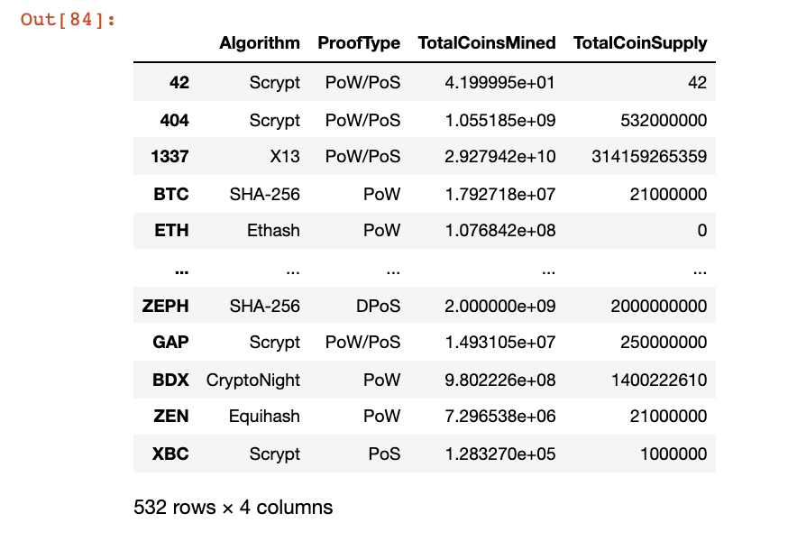
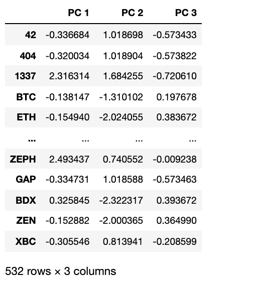
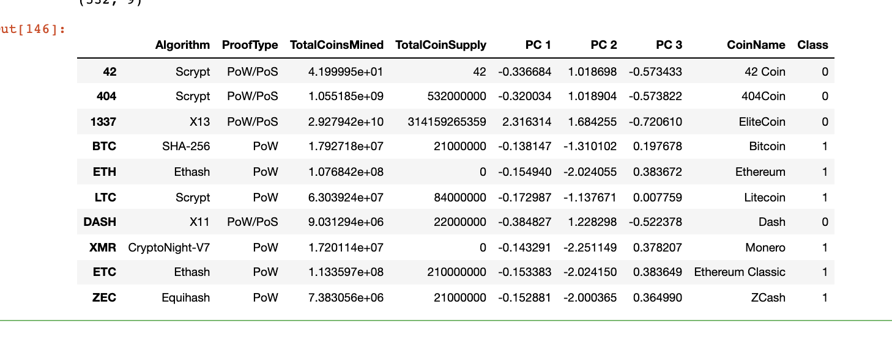
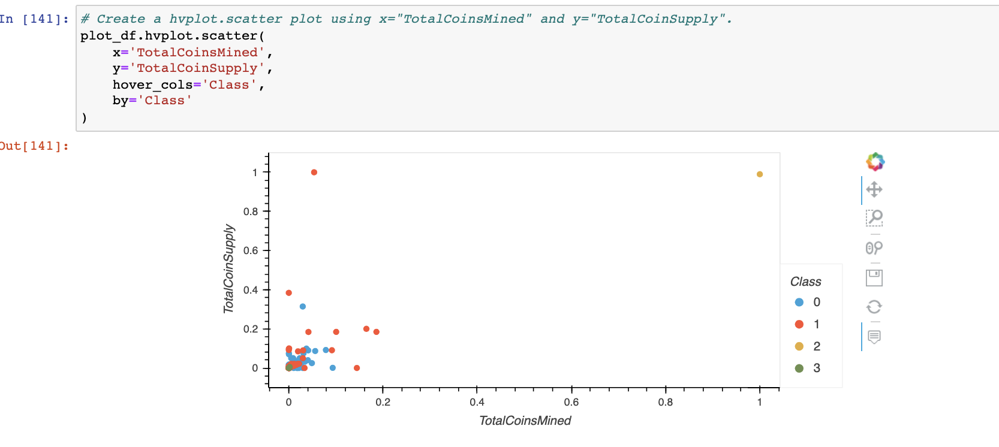

# Cryptocurrencies

## Overview

Martha is a senior manager for the Advisory Services Team at Accountability Accounting, one of your most important clients. Accountability Accounting, a prominent investment bank, is interested in offering a new cryptocurrency investment portfolio for its customers. The company, however, is lost in the vast universe of cryptocurrencies. So, they’ve asked me to create a report that includes what cryptocurrencies are on the trading market and how they could be grouped to create a classification system for this new investment.

The data Martha will be working with is not ideal, so it will need to be processed to fit the machine learning models. Since there is no known output for what Martha is looking for, she has decided to use unsupervised learning. To group the cryptocurrencies, Martha decided on a clustering algorithm. She’ll use data visualizations to share her findings with the board.

## Analysis & Results 

This new assignment consists of four technical analysis deliverables. 

Deliverable 1: Preprocessing the Data for PCA

Deliverable 2: Reducing Data Dimensions Using PCA

Deliverable 3: Clustering Cryptocurrencies Using K-means

Deliverable 4: Visualizing Cryptocurrencies Results

Deliverable 1: Using your knowledge of Pandas, we’ll preprocess the dataset in order to perform PCA in Deliverable 2.

Here is what he crypto_df look like

Deliverable 2: Using our knowledge of how to apply the Principal Component Analysis (PCA) algorithm, we’ll reduce the dimensions of the X DataFrame to three principal components and place these dimensions in a new DataFrame.

Here is the DataFrame that has the following 3 columns, PC 1, PC 2, PC 3.

Deliverable 3: Using our knowledge of the K-means algorithm, we’ll create an elbow curve using hvPlot to find the best value for K from the pcs_df DataFrame created in Deliverable 2. Then, we’ll run the K-means algorithm to predict the K clusters for the cryptocurrencies’ data.

Deliverable 4: Using our knowledge of creating scatter plots with Plotly Express and hvplot, we’ll visualize the distinct groups that correspond to the three principal components we created in Deliverable 2, then we’ll create a table with all the currently tradable cryptocurrencies using the hvplot.table() function.

